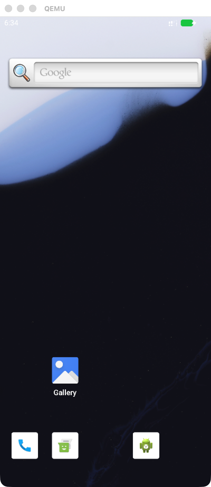

[English](docs/README.md) | 简体中文

<p align="center">
  <a href="https://www.opencecs.com">
    
  </a>
</p>

<h1 align="center">OPENCECS</h1>

<p align="center">
  <a href="https://www.opencecs.com"><b>www.opencecs.com</b></a>
  <a href="https://github.com/opencecs/tebox">GitHub</a>
</p>

<p align="center">
  <b>tebox — 桌面端 Android GSI 运行基座</b><br>
  通用 GSI 镜像启动能力  VirGL 图形加速  Soft Vendor HAL 示例
</p>

<p align="center">
  <a href="https://github.com/opencecs/tebox/stargazers"></a>
  <a href="https://github.com/opencecs/tebox/network/members"></a>
  <a href="LICENSE"></a>
  <a href="https://www.opencecs.com"></a>
</p>

## 项目简介

**tebox** 是一套面向桌面端的 **Android GSI 运行基座**：在 QEMU 上提供通用的 ARM64 GSI 镜像启动能力，并内置 VirGL / Mesa 图形加速、GKI 内核与 soft vendor HAL 示例，方便你直接上手验证、二次开发和自动化。

仓库：[github.com/opencecs/tebox](https://github.com/opencecs/tebox)  官网：[www.opencecs.com](https://www.opencecs.com)

### 基座能力

- **通用 GSI 运行**：以官方 aosp_arm64 GSI 为默认示例，也可替换为任意兼容的 ARM64 GSI（例如 Google、Samsung 等厂商发布的 GSI / Treble 镜像，或由 Pixel、Galaxy 等设备提取的 system 镜像）
- **图形与输入**：VirGL GPU 加速、virtio 触摸屏
- **开机所需 HAL 示例**：已内置 Graphics、KeyMint（soft）、Health、Power、Audio 等 soft / stub 实现，可按厂商需求裁剪或替换

### Mesa/VirGL 视频直通

VirGL renderer 和 Mesa guest driver 已支持把 Gallium video 命令转发到宿主
Mesa VA-API。Linux 宿主可按下面的顺序启用这条路径：

```bash
VIRGL_VIDEO=1 bash scripts/build-virglrenderer.sh
MESA_VIDEO_CODECS=h264dec,h264enc,h265dec,h265enc,vp9dec,av1dec \
  ./scripts/build-mesa-android.sh
VIRGL_VIDEO=1 ./scripts/build-qemu.sh
```

宿主需要 `libva`、`libva-drm`、Mesa VA-API 驱动和可访问的 `/dev/dri/renderD*`；
也可以用 `VIRGL_VIDEO_DRM_DEVICE=/dev/dri/renderD128` 指定节点。启动时仍使用
`FORCE_VIRGL=1`。vendor C2 store 会在 guest 启动时探测 VirGL video codec；只有
真实的 AVC encoder 能创建时才注册 `c2.mesa.avc.encoder`，否则不会把不可用的
组件列给 MediaCodec。没有宿主 DRM/VA-API（例如 macOS Apple GPU 环境）时，
QEMU 仍可使用 3D VirGL，但 `scrcpy` 会继续看到 software encoder；这不是硬件
编码通路。

> 说明：能否完整启动取决于目标 GSI 的 Treble / VINTF 要求；厂商专有分区与闭源服务需自行适配。基座提供的是可扩展的运行与 HAL 框架，而不是某一机型的一键刷机包。从设备提取或使用第三方 / 厂商镜像、固件与闭源组件时，请自行确认并遵守当地法律、厂商许可协议与版权要求；相关合规与法律风险由使用者自行承担。

### 相关资源

- 各类社区 GSI 镜像汇总下载：[Mystic GSI Updates（SourceForge）](https://sourceforge.net/projects/mystic-gsi-updates/files/)

## 适用场景

- 在桌面环境验证 / 对比不同 GSI 镜像
- 开发与调试 vendor HAL、图形栈与系统服务
- 搭建 CI，对 GSI + HAL 改动做自动化编译与冒烟

## 运行环境

| 宿主 | 说明 |
| --- | --- |
| **macOS ARM64**（Apple Silicon，M1–M4） | 推荐；HVF + VirGL 已验证 |
| **Linux ARM64** | 支持原生构建与运行（KVM） |
| **Linux x86_64** | 主要用于交叉编译 Android ARM64 客体 |

客体为 **aarch64 Android GSI**；推荐配备可用 GPU 与图形会话。

## 启动截图

<p align="center">
  
</p>

## 正确拉取源码

```bash
git clone https://github.com/opencecs/tebox.git
cd tebox
```

内核模块 `*.ko` 直接随 Git 仓库提交；`system.img` 与 GKI `Image` 不进 Git，首次 `./run` 会从
[mirror.opencecs.com](https://mirror.opencecs.com) 下载并校验 SHA-256：

- GSI：[`.../GSI/aosp_arm64-BP4A.251205.006/system.img`](https://mirror.opencecs.com/f/GSI/aosp_arm64-BP4A.251205.006/system.img)
- GKI：[`.../GKI/gki-6.1-android14-gsi/Image`](https://mirror.opencecs.com/f/GKI/gki-6.1-android14-gsi/Image)

也可把兼容的自定义文件放到对应路径；已有有效文件不会被覆盖。

`vendor.img` 和 `initramfs.img` 不提交到仓库，由 `./run` 根据源码自动生成。首次使用还需准备当前宿主平台的 QEMU/VirGL，构建入口见 [构建说明](.ci/README.md)；`out/` 中的本地编译结果不会随克隆下载。

## 快速开始

```bash
bash .ci/install-deps.sh
FORCE_VIRGL=1 SNAPSHOT=1 ./run
```

默认会启动 AOSP GSI 示例变体；运行时会准备缺失的 `system.img`。替换
`src/aosp/<variant>/images/system.img` 即可尝试其他 GSI。

ADB / scrcpy 调试：停止已运行的虚拟机后，执行
`python3 scripts/adb-scrcpy.py --launch`。脚本使用 VirGL 和快照模式，开启
`127.0.0.1:5555` 到客体 adbd 的 TCP 转发（`ro.adb.secure=0`，无需 RSA 授权）。
先检查原生 1080 × 2400 的 H.264 编码，失败后单独检查 720 × 1600 的编码输出，
客体显示分辨率不变。录像、解码截图和日志保存在 `out/codec-probe/`；
关闭 scrcpy 会停止该脚本启动的虚拟机。`./run` 默认开启 ADB
（`127.0.0.1:5555` → 客体 5555）；`QEMU_ADB=0` 可关闭，`ADB_PORT` 可改宿主端口。
也可 `SNAPSHOT=1 ./run` 后再执行 `python3 scripts/adb-scrcpy.py` 连接。

BP4A 变体通过 vendor init 选择 C2 AIDL 和框架内置 GraphicBufferSource。
mapper 的 CPU 只读锁使用 GBM 回读真实 GPU 像素，返回独立快照，解锁不会上传到
scanout；Mesa 磁盘缓存关闭，vendor swcodec seccomp 扩展仅允许查询 CPU affinity。
已实测软件 AVC 的原生 1080 × 2400 录像及动态画面，编码器仍为
`c2.android.avc.encoder`。仅重建 mapper 可运行
`bash src/aosp/aosp_arm64-BP4A.251205.006/hardware/graphics/stub/build-mapper.sh`，
停止 VM 后将产物安装到该变体 vendor 的 `lib64/mapper.stub.so` 和
`lib64/hw/mapper.stub.so`，再由 `./run` 重建 vendor.img。

## 许可证

本项目以 [Apache License 2.0](LICENSE) 开源。第三方源码与二进制仍遵循其各自许可证。

## Star History

<a href="https://www.star-history.com/#opencecs/tebox&Date">
 <picture>
   <source media="(prefers-color-scheme: dark)" srcset="https://api.star-history.com/svg?repos=opencecs/tebox&type=Date&theme=dark" />
   <source media="(prefers-color-scheme: light)" srcset="https://api.star-history.com/svg?repos=opencecs/tebox&type=Date" />
   
 </picture>
</a>

## 贡献者

感谢所有参与 tebox 的贡献者。

<a href="https://github.com/opencecs/tebox/graphs/contributors">
  
</a>

Made with [contrib.rocks](https://stg.contrib.rocks).

欢迎在 [GitHub](https://github.com/opencecs/tebox) 提交 Issue / PR。
